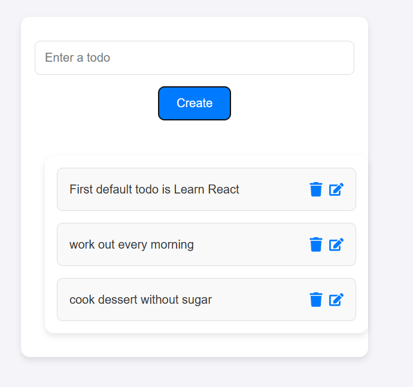

# React TypeScript Frontend App

Welcome to the React TypeScript Frontend App! This is a basic web application built with React and TypeScript.

## Demo

You can view the live demo of the application by clicking the link below:

[Live Demo](https://joyful-unicorn-e615f4.netlify.app/)

## Logo

Here is the logo of the app:



## Features

- React-based frontend
- Built with TypeScript for type safety
- Simple and clean UI

## Setup and Installation

To run this project locally, follow the steps below.

### Prerequisites

Ensure you have the following installed:

- [Node.js](https://nodejs.org/)
- [npm](https://www.npmjs.com/) or [yarn](https://yarnpkg.com/)

### Installation Steps

1. Clone this repository to your local machine:

   ```bash
   git clone https://github.com/yourusername/your-repo-name.git
